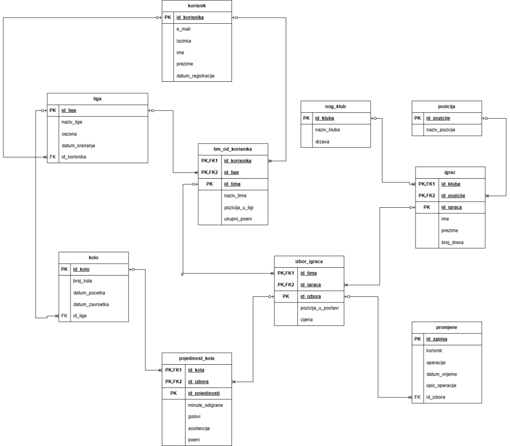
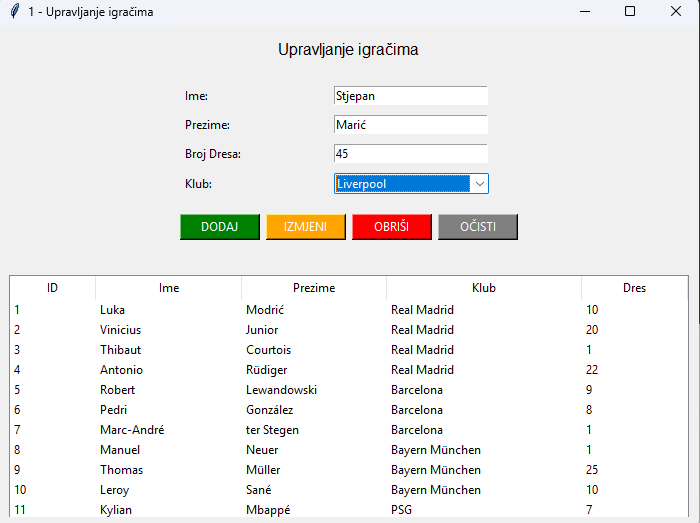
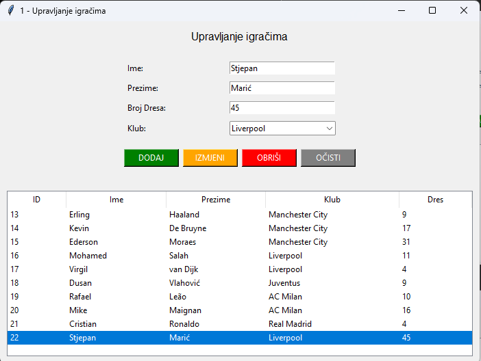

# Fantasy Football League Information System

A relational database and desktop application for managing a fantasy football league — built around a real ERA data model, PostgreSQL triggers for automated scoring, and a Python Tkinter interface.

Built as a project for the *Databases 2* course at the Faculty of Organization and Informatics, University of Zagreb.

## Overview

The system lets users act as virtual managers: they build a squad from real footballers, and player performance in real matches (goals, assists, minutes played) automatically translates into fantasy points through database triggers. A desktop GUI (Python + Tkinter) provides the actual add/edit/remove/browse workflow on top of the database.

## Data model

The database consists of 10 interconnected tables modeling users, leagues, rounds, teams, real football clubs, players, player selections, round-by-round performance, and an audit log of changes.



Key relationships:
- A **user** creates **teams** within a **league**, made up of **selected players** (`izbor_igraca`).
- Each **player** belongs to a real **club** and plays a specific **position**.
- **Round-by-round stats** (`pojedinost_kola`) record goals, assists, and minutes played per player per round — this is what triggers automatically convert into fantasy points.
- A **change log** (`promjene`) tracks operations performed on player selections.

## Automated scoring via triggers

Two PostgreSQL triggers enforce the league's core business rules directly in the database:

- **`fn_izracun_poena`** — automatically calculates a player's fantasy points from goals, assists, and minutes played whenever a round's stats are inserted or updated.
- **`fn_provjera_broja_igraca`** — prevents a team from exceeding the 11-player squad limit.

See [`schema.sql`](schema.sql) for the full table definitions and trigger logic.

> **Note:** `schema.sql` reconstructs the schema and trigger logic described in the project report/ERA model. It hasn't been re-validated against the original live database — see [Status](#status) below.

## Desktop application (Python Tkinter)

The interface lets a manager connect to the database, add/edit/remove players, and view league standings.

| Player management | League standings |
|---|---|
|  |  |

## Tech stack


## Project structure

```
├── schema.sql       # database schema + triggers (see note on status below)
└── docs/
    ├── era_diagram.png
    ├── ui_player_management.png
    └── ui_team_standings.png
```

## Status

This repo currently documents the data model and design in full, along with the schema. The original Tkinter application source (`.py`) and the psycopg2 database connection code have not been added yet — they'll be uploaded here once available, alongside a DataGrip-exported DDL for an exact match with the original database.

## License

This project is available under the MIT License.
